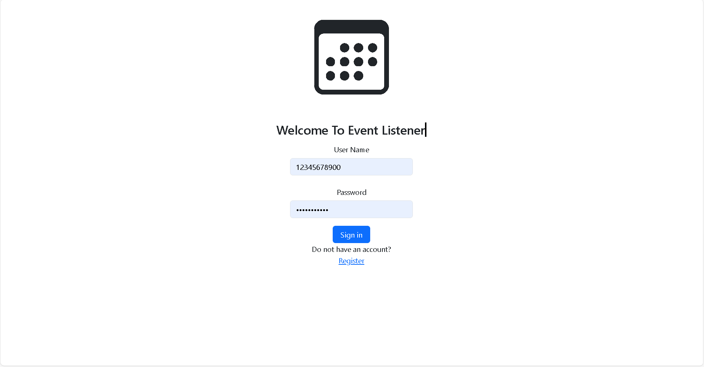
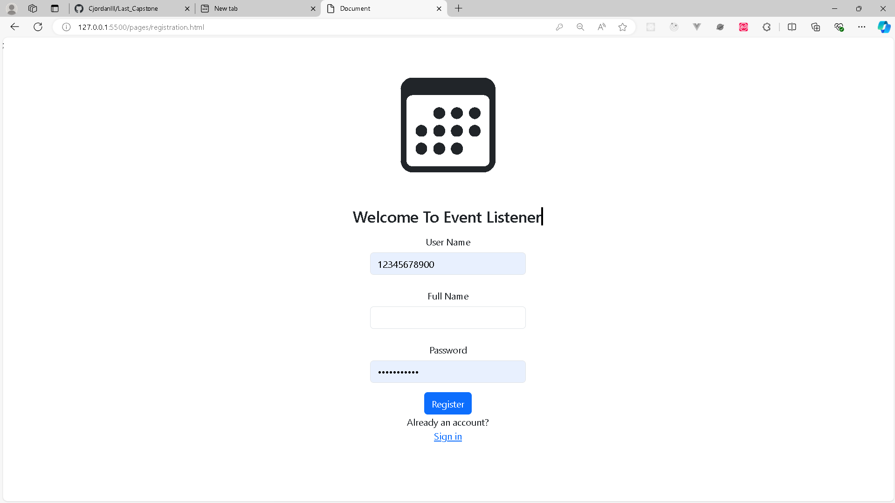
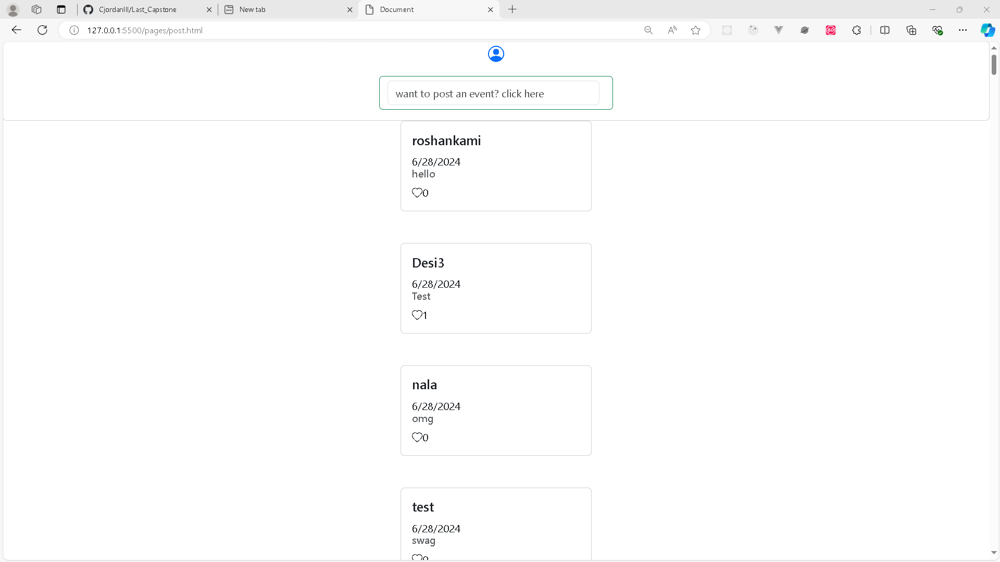
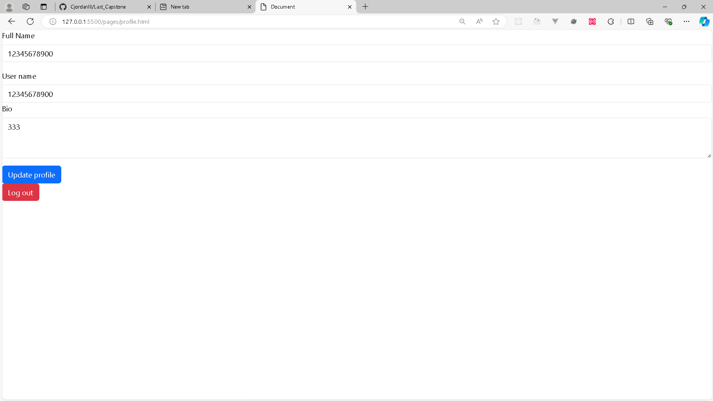

# Last_Capstone

## Project Description

Post about the event you have so others can join!!!

### Sign Up page

- **Register:** Allows users crate an account.
- **Search by Park Type:** Enables users to select a park type from a dropdown to find national parks that match the description.
- **View All National Parks:** Option to view all national parks.
- **Visit Links:** Some parks have a "Visit" property with a URL, allowing users to visit the park's page.

### Sign Up page

- **Login:** Users can login to they account

### Post page

- Allows users to see post
- Allows users to create post

## Installation

To run this project locally:

1. Clone the repository:
   ```bash
   git clone https://github.com/your-username/Last_Capstone.git
   ```

## screenshots








## updates after beata

- add delete btn
- add like btn
- filter through comments
- make website pretty
- allow photos
- make it better
